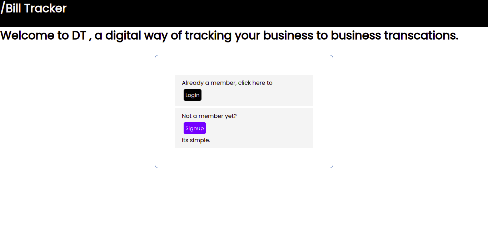
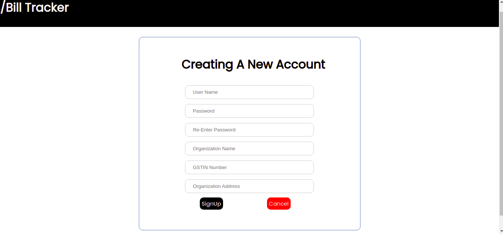
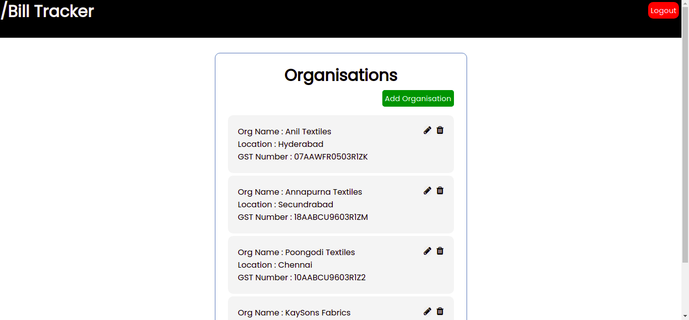
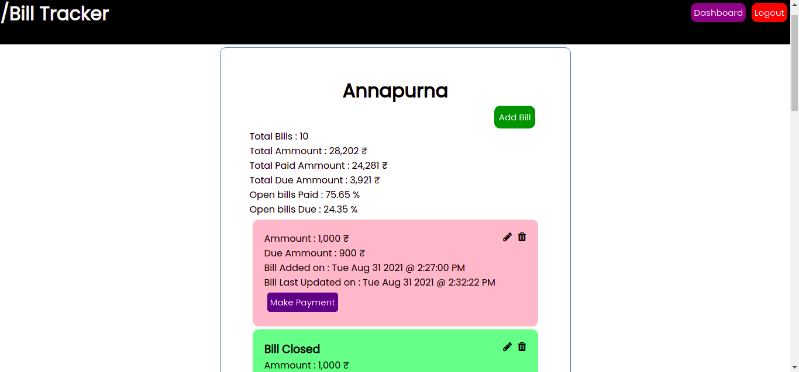

# Bill-Tracker
A Web Service that stores business to business transactions **digitally**.

## :bookmark_tabs: What's In This Document
- [Inroduction](#Introduction)
- [Get Up and Running in 5 Minutes](#Get-Up-and-Running-in-5-Minutes)
- [How to Use Bill Tracker](#How-to-Use-Bill-Tracker)

## Introduction

Bill Tracker is an web application that helps to manage the books of accounts in an  organisation.

It tracks bills of various organization's from whom a organisation is purchsing goods.

It  hepls in tracking due and completed payments in an organised way.

## Get Up and Running in 5 Minutes
You can get the Bill Tracker up and running in your local machine with in 5 minutes by doing the following steps.

The following steps consider Node.js is available in the machine. If not you can get it from [here](https://nodejs.org/en/).

**Clone the repository**

Open the terminal and paste the following command to clone.

```shell
git clone https://github.com/Nikhilnama18/Bill-Tracker
```

**Install Vue.js and dependencies**

Navigate to the root directory of the project and install the dependencies and start the back-end server.

```shell
npm install
npm run dev
```

Get back to the root directory and open front-end and run the front-end service 

```shell
cd ../front_end/
npm run serve
```

That's it , now your Bill Tracker is Up and Running at  [here](http://localhost:8080)

## How to Use Bill Tracker

Open the Bill Tracker application running at ```http://localhost:8080```

You'll be looking at a page like this 

<p align="center">
  <a href="https://github.com/Nikhilnama18/Bill-Tracker">
    
  </a>
</p>

Go and Create an account by clicking on ```singup``` 

Once You click singup you'll be viewing a page 

<p align="center">
  <a href="https://github.com/Nikhilnama18/Bill-Tracker">
    
  </a>
</p>

Fill the details and click ```singup```. Now login with the credentials you just created.

Your are now in the Organisation Page, where multiple business-organisations bills are tracked individually and you can add a new 
organisation by clicking on ```Add Organisation```.

<p align="center">
  <a href="https://github.com/Nikhilnama18/Bill-Tracker">
    
  </a>
</p>

Clicking on an Organisation will show the bills of that particular organisation.

<p align="center">
  <a href="https://github.com/Nikhilnama18/Bill-Tracker">
    
  </a>
</p>

You can ```Add Bills``` , edit and delete bills the that are existing .

